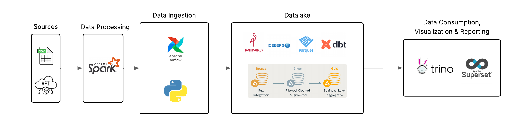

# Open-Source Data Lake

## Overview
A **100% open-source data lake** stack, containerized with Docker for portability, based on **AWS** infraestructure and implementing the **Medallion Architecture** (Bronze, Silver, Gold layers).

## Medallion Architecture  

Bronze: Raw data in MinIO (S3-compatible)

Silver: Validated, partitioned datasets

Gold: Business aggregates

## Core Technologies

### **1. Storage & Metadata**
- **MinIO**: S3-compatible object storage 
- **Hive Metastore**: Metadata storage in MariaDB

### **2. Processing**
- **Apache Spark**: standalone cluster
- **dbt**: SQL transformations 

### **3. Orchestration**
- **Airflow**: Jobs scheduling

### **4. Data Consumption**
- **Trino**: Distributed SQL engine
- **Superset**: Visualizations & Dashboards

---

## Key Features
- **Pure Open-Source**
- **Dockerized**
- **AWS-Compatible**: Based on the AWS ecosystem.

---
# Installation (before run the containers)

## Airflow

Create the directories first: 
```
mkdir -p ./airflow/dags ./airflow/logs ./airflow/plugins ./airflow/config ./airflow/sql ./airflow/profile \\
echo -e "AIRFLOW_UID=$(id -u)" > .env
```
## Virtual Environment (in WSL)

### Install
```
apt install python3.10-venv
```
### Creation
Create the virtual env at ./jobs/dbt:
```
python3 -m venv dbt-env
```
### Activation

```source dbt-env/bin/activate```

### Deactivation
```deactivate```

## Install DBT trino and postgres
```python3 -m pip install dbt-core dbt-trino dbt-postgres```

# Docker & Images versions

* **Docker**: 4.4.0
* **Airflow**: apache/airflow:2.9.0-python3.12
* **Postgres**: postgres:13
* **Spark**: bitnami/spark:3.5
* **Redis**: redis/latest
* **Trino**: trinodb/trino:424
* **MariaDB**: mariadb:10.5.8
* **Hive-Metastore**: bitsondatadev/hive-metastore:latest
* **MinIO**: minio/minio:latest
* **Superset**: apache/superset:latest

# Create containers

```
docker compose up --build -d
```
# Architecture 



